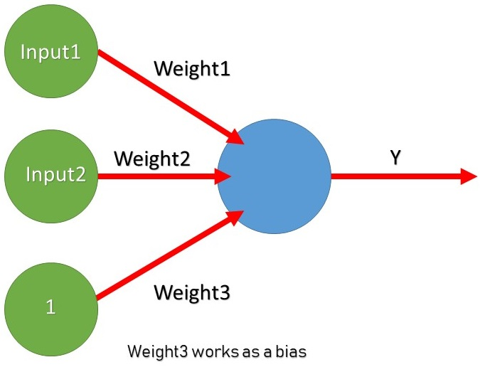

# Perceptron 
A Perceptron is used for binary Classification. It is a Single artificial neuron using the Heaviside Step Function as Activation Function.

# Requirements
> Numpy

# About the Source code
The source code is for a Perceptron learning a "OR logical" operations.

# Result
