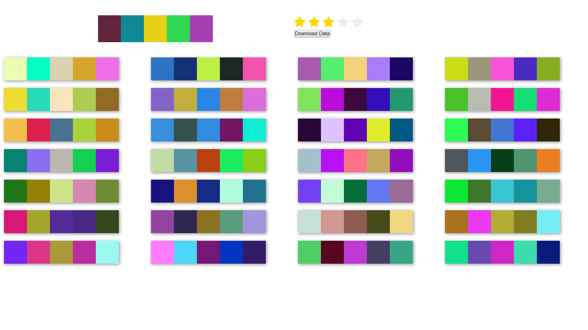

# Recommendation System
It is a Color pallete recommender. It uses a [Brain.js](https://github.com/BrainJS) for building a feed forward neural network.The neural network has 15 inputs, 10 hidden layer and a single output.

# Requirement
> Webserver
> Brain.js
> Font Awesome

# Screenshot
